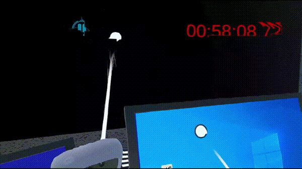

# 1. 프로젝트 개요

META SPACE의 주 고객 층은 VR 기기를 많이 사용하는 10~20대 청소년·청년을 대상으로 합니다. 앞으로 인류가 나아가야할 우주에 대한 흥미를 일으키고, 간단한 전공 관련 퀴즈를 풀어내며 성취감과 함께 자연스럽게 우주 탐사에 필요한 전공 지식에 대한 흥미를 가질 수 있도록 하였습니다.

META SPACE는 우주 탐사 중 발생한 우주선 사고를 배경으로 합니다. 4명의 플레이어는 의사, 생화학자, 기계공학자, 전기공학자가 되어 문제를 해결하고 제한 시간 내에 우주선을 탈출해야 합니다.  

[📼시연영상](https://youtu.be/ptTYUcO5zIE)

### 개발 배경 및 목적:

- 개발배경
    - META SPACE는 자원 고갈, 인구 과잉, 환경 파괴 등으로 인류가 생존하기 어려워진 미래를 배경으로 합니다. 이러한 위기 상황의 제시를 통해 META SPACE는 플레이어에게 흥미로운 스토리와 몰입감을 제공하고, 자원 관리 등의 문제에 대한 인식을 고취시키며, 교육적 가치와 사회적 메시지를 전달하고자 합니다.
- 개발목적
    - 게임을 통해 플레이어는 기초적인 우주 과학, 물리학, 엔지니어링 등에 대해 배우고 전략적인 사고와 문제 해결력 등을 기를 수 있습니다.
    - 또한 플레이어는 다른 팀원들과 협력하는 과정을 통해 팀워크의 중요성, 협력의 가치를 체득할 수 있습니다.
    - 아울러 VR 기술을 활용하여 현실감 넘치는 우주 환경을 구현함으로써 VR 게임의 새로운 가능성을 탐구하고 플레이어에게 새로운 경험을 선사하고자 합니다.

# 2. 개발환경 및 개발언어

- 개발 환경
    - Unity 2022.2.20.f1
    - Blender 4.2
    - Meta XR All-in-One SDK 66.0.0
    - Oculus XR Plugin
    - XR Plugin Management
    - Photon Fusion 2
- 개발 언어
    - C#

# 3. 아키텍처

(1) 게임은 게임 런처와 게임 내부 씬으로 나누어진다.

(2) 게임 내부는 단일 신으로 이루어지며, 시스템 구성 단위의 큰 기능은 매니저를 두어 관리하였다.

(3) 매니저 스크립트: Audio, Display UI, Game, Interface, Inventory, Launch UI, Level, Panel, Quest, Resource

(4) 네트워크 토폴로지: Photon Fusion의 Host 아키텍처

# 4. 주요 기능

### 4-1. 게임 씬

1-1. 게임 런처   
   
   

1-2. 우주선 1층   
  

1-2. 우주선 2층   
  

### 4-2. 승리 규칙

4명의 플레이어가 협력하여 고장난 우주선에서 탈출한다. 각 플레이어는 직업에 맞는 퀘스트와 협력 퀘스트를 수행한 후 얻을 수 있는 부품을 가지고 비상 탈출정에 탑승한다. 제한 시간 15분 이내에 모든 부품을 모아 탈출하면 승리하게 된다.

### 4-3. 조작 방법

조작은 VR 플랫폼을 타겟하여 개발하였다. 

(1) 플레이어 이동: LS 

(2) 카메라 이동  : RS 

(3) 상호작용     : LT or RT 

(4) 잡기         : LT + LG or RT + RG 

(5) 달리기       : RT 

(6) 점프         : X 

(7) 특수         : Y 

(8) 선택         : A 

(9) 취소         : B

### 4-4. 프로젝트 주요기능

(1) 로비

 플레이어는 로비를 생성하고 플레이어를 모집하거나 이미 생성된 로비를 검색하여 참가할 수 있습니다.

(2) 멀티 플레이 

 4인 멀티플레이 게임으로, 플레이어는 각자 직업을 부여받아 퀘스트를 진행하게 됩니다.

(3) VR 조작

 플레이어는 VR 플랫폼에서 아바타와 카메라를 조작할 수 있습니다.

(4) VR 상호작용 

 플레이어는 VR 컨트롤러를 통해 물건 혹은 UI를 집거나 만져서 상호작용할 수 있습니다.

(5) 인벤토리 시스템 

 플레이어는 물건과 상호작용하여 인벤토리에 물건을 넣고, 뺼 수 있습습니다.

(6) 퀘스트 시스템 

 퀘스트 안내를 통해 플레이어가 최대한 헤매지 않고 게임을 즐길 수 있도록 하였습니다.

# 5. 게임 플레이

### 5-1. 의사

- 조종사 발견 후, 탈 것을 통해 옮기기
    - 조종실 옆 password 기계에 다가가 E버튼/ VR - A버튼을 통해 상호 작용시, passwordcanvas가 활성화 되며 해당해서 버튼에 rayinteraction을 통해 버튼 터치 가능
        
          
        
    - 조종사에 가까이 다가가 E버튼/VR - B버튼으로 상호 작용시, diaglogue panel이 활성화 되며 대화 가능
        
          
        
    - 의무실에서 휠체어에 다가가 E버튼/VR - B버튼으로 상호작용시, 휠체어가 플레이어의 자식으로 할당되고, 휠체어의 위치가 플레이어 기준으로 고정되어, 플레이어의 position과 rotation의 값에 따라 변경
        
          
        
          
        
- 조종사 정밀 검사 진행
    - 정밀 검사 기계에 다가가 E버튼/ VR - A버튼을 통해 상호 작용시, machinecanvas가 활성화 되며 해당해서 버튼에 rayinteraction을 통해 버튼 터치 가능
        
          
        
    - 해당 정밀 검사 기계에서 조종사가 근처에 있다면 버튼 클릭으로 침대의 position 값으로 조종사가 위치가 변경. 검사 시작을 누르면 기계의 애니메이션이 실행되며, 해당 검사 결과가 홀로그램으로 나타나도록 구현
        
          
        
- 조종사 치료
    - 로봇 치료실에서 수술 장면을 촬영할 카메라를 하나 두고, Render Texture를 생성하여 카메라의 Target Texture을 해당 텍스처로 설정한 뒤 material의 `Shader`를 `Unlit/Texture` 로 설정하여 해당 texture를 메인 텍스처로 두어 수술 장면을 라이브로 볼 수 있는 모니터 구현
        
          
        
          
        
    - 수술은 절개, 흡입, 붕대로 감싸기의 절차로 진행. clipping-plane을 이용해 절개 구현. 흡입과 같은 경우 흡입 버튼을 누를 시, 피 오브젝트를 하나씩 제거할 수 있도록 기능 구현.
        
          
        
- 조종사에게 약 투여 후, 2층으로 이동
    - Inventory 로직을 이용해서 약에 collectable 스크립트를 이용해서 Inventory에 해당 약이 수집 될수 있도록 구현
        
          
        

### 5-2. 생화학자

- 모니터 UI 상호작용
    - 모니터의 힌트를 통해 주변 환경에서 정답을 유추할 수 있도록 설계
    - 이를 통해 사용자가 논리적인 흐름으로 사고할 수 있도록 함
    - 모니터 UI 와 VR 기기의 상호작용을 설정하여 터치 가능한 UI 를 구현
    - 모니터의 Material 을 바꾸는 방식을 사용하여 상호작용 전 후를 변경
- 화이트 보드, 메모 힌트 활용
    - 실험실 내 화이트보드와 메모들을 수집하여 반응식에 필요한 물질을 유추할 수 있도록 함
    - 이를 통해 사용자는 과학적 지식을 직·간접적으로 배우게 됨
    - 화이트보드와 메모는 가져온 에셋과 직접 제작한 Material을 이용하여 구현
    - 메모의 글이 너무 작을 수 있으므로, 이를 확대하여 볼 수 있도록 확대 기능을 추가
- 액화 장치, 혼합기, 설명서
    - 설명서 아이템의 설명을 읽고 액화 장치와 혼합기를 사용할 수 있도록 설계
    - 액화 장치와 혼합기에 필요한 물질은 화이트보드와 메모를 통해 유추할 수 있음
    - 실제 실험실에서 물체를 직접 혼합하는 것 만큼 기기를 다루고 설명서를 잘 읽는 것이 중요함. 따라서 사용자는 이를 통해 실제 실험자가 된 것 같은 체험을 할 수 있음
    - 장치에 아이템을 올려 놓는 것은 Inventroy 기능의 아이템 들기와 아이템 놓기를 활용함
    - 아이템을 놓을 수 있는 오브젝트 타입을 만들어서 현제 들고있는 아이템을 놓도록 설계
- 로켓 연료
    - 혼합기를 활용하여 최종 단계까지 완료했을 경우, 로켓 연료를 얻을 수 있음
    - 로켓 연료의 배합은 게임상의 편의성과 현실성을 고려하여 실제 로켓 연료를 만드는 과정과는 상이하나, 배합식을 유사하게 만들었음

### 5-3. 기계공학자

- 모니터와 메모, 방 내부 힌트
    - 모니터와 메모의 힌트를 통해 주변 환경에서 정답을 유추할 수 있도록 설계
    - 사용자에게 문제 해결 능력과 관찰력을 기를  수 있도록 함
    - 모니터 UI 와 VR 기기의 상호작용을 설정하여 터치 가능한 UI 를 구현
    - 모니터에서 비밀번호 입력 전후 상태를 변화시켜 측면 문을 조작하도록 구현

### 5-4. 전기공학자

- 제어 패널 전선 연결
    - 플레이어가 전선을 편하게 집을 수 있도록 Distance Grab으로 집을 수 있도록 구현
        
          
        
    - 전선의 끝을 패널에 가져다 대고 놓으면 전선이 패널에 부착되도록 구현 (전선의 끝과 패널의 구멍이 붙는다.)
        
          
        
    - 일부 전선들을 올바르게 연결하면 일부 모니터가 켜지도록 구현
    - 올바른 연결 방법을 플레이어가 알 수 있도록 전선이 올바르게 연결된 상태의 패널 사진을 아이템으로 제공
- 2층 계단 내리기
    - 제어실 두번째 모니터의 퍼즐을 해결하면 계단이 내려오도록 구현
    - 계단이 내려올 때 카메라를 전환하여 계단 내려오는 장면을 볼 수 있도록 구현
        
          
        
    - 모니터 UI 활성화 시 UI 내부 영역 선택, 키보드 버튼 선택 등 선택한 UI에 따라 적절한 효과음(마우스 클릭 소리, 키보드 소리)이 나오도록 구현
    - 비밀 번호를 올바르게 입력하면 다음 페이지로, 닫힘 버튼을 누르면 초기 페이지로 돌아가도록 구현, 비밀 번호를 잘못 입력하면 오답임을 알려주도록 구현
    
      
    
      
    
- 계단에 놓인 장애물 파괴하기
    - 제어실 세번째 모니터의 퍼즐을 해결하면 계단에 놓인 장애물을 레이저로 파괴하도록 구현
    - 레이저로 장애물을 파괴할 때 카메라를 전환하여 파괴하는 장면을 볼 수 있도록 구현
        
      
        
    - 모니터 UI 관련 기능은 두번째 모니터와 유사한 방식으로 구현
    
      
    
      
    

### 5-5. 협동 퀘스트

- 물 처리 시스템 수리하기
    - 기어 미로
        - 좌우 버튼을 누르면 통로와 연결된 톱니바퀴가 90도 방향으로 좌회전 또는 우회전하도록 구현
        - 2명 이상이 협동하여 미로를 빠져나갈 수 있게 설계
        - BoxCollider를 사용해 플레이어가 미로를 통과하거나 지하로 떨어지지 않게 구현
        
          
        
    - 파이프 연결
        - F-F, F-M, M-M 파이프를 적절하게 연결하여 오브젝트 간 상호작용이 되도록 구현
        - 잘못 연결 시 스파크 이펙트 발생
        
          
        
          
        
- 비상식량 가져오기
    - 컨테이너 퍼즐
        - 화물실 콘솔의 버튼을 눌러서 로봇 팔을 조종하고 컨테이너를 붙이고 뗄 수 있도록 구현
        
          
        
        로봇 팔 이동
        
          
        
        컨테이너 붙이기/떼기
        
        - 컨테이너를 붙힌 상태에서 다른 컨테이너 또는 플레이어랑 부딪치거나 퍼즐 범위를 벗어나면 이전 위치로 돌아오도록 구현
        - 로봇 팔이 이동 중에는 다른 버튼을 눌러 다른 조작을 수행하지 못하도록 구현
        - 2인으로 퀘스트를 수행하는것을 고려하여 퍼즐 디자인
    - 상자 더미에서 비상식량 획득
        - 상호작용 범위에 플레이어가 들어가면 상자 더미를 조사하라는 UI를 띄워주도록 구현
        - 버튼을 누르면 스폰되면서 플레이어 방향으로 식량이 날아오도록 구현
            
              
            
- 탈출정 타고 탈출하기
    - 제한 시간 내 모든 플레이어가 퀘스트를 완료하지 못하면 Bad Ending
    - 제한 시간 내 모든 플레이어가 퀘스트를 완료하고 필요한 물품을 모아 탈출정에 탑승하면 클리어 시간과 함께 Happy Ending 화면이 뜬다
    
       
    

# 6. 기대효과 및 활용분야

META SPACE는 VR 플랫폼을 통해 현실감 넘치는 간접 우주 체험을 통해 플레이어에게 우주에 대한 흥미를 일으킬 수 있습니다. 또한 사실적인 퀘스트를 통해 직업을 간접적으로 체험해 볼 수 있어 청소년층이 과학 및 공학 분야에 자연스럽게 관심을 가질 수 있도록 개발되었습니다. 또한 플레이어는 멀티플레이 중 협력을 통해 협동심을 기르고, 퀴즈 형식의 퀘스트를 완료하면서 플레이어가 문제 해결능력을 기르고 전략적인 사고를 할 수 있도록 합니다.
이처럼 META SPACE는 플레이어엑 교육적 가치와 엔터테인먼트 요소를 동시에 제공하고 있습니다. 따라서 우주에 대한 교육 자료, 과학 교육 프로그램, STEM 관련 교과 과정에 통합되어 학습 도구로 사용될 수 있습니다. 또한 관련된 박람회 등에서 관람객들에게 몰입형 체험을 제공하는 콘텐츠로도 이용될 수 있을 것입니다. 이러한 다양한 활용 가능성을 통해 우주와 과학에 대한 흥미를 널리 확산시키는 데 기여할 수 있을 것입니다.

# 7. 기타

### 7-1. 참고 자료

- SDF D 포럼 인터뷰 자료 https://sdf.or.kr/m/newsletter/10000001283
- 한겨래 신문 보도자료https://www.hani.co.kr/arti/society/environment/1134211.html
- 과학기술정보통신부 우주개발진흥 기본계획 https://www.msit.go.kr/bbs/view.do?sCode=user&bbsSeqNo=65&nttSeqNo=3017397

# 8. 팀원

<table>
 <tr>
    <td align="center"></td>
    <td align="center"></td>
    <td align="center"></td>
    <td align="center"></td>
    <td align="center"></td>
  </tr>
  <tr>
    <td align="center"><a href="https://github.com/KTaeGyu"><b>김태규</b></a></td>
    <td align="center"><a href="https://github.com/Starbow-Break"><b>김범수</b></a></td>
    <td align="center"><a href="https://github.com/1234jienf"><b>백지윤</b></a></td>
    <td align="center"><a href="https://github.com/namoo1818"><b>이민지</b></a></td>
    <td align="center"><a href="https://github.com/aycho00"><b>조아영</b></a></td>
  </tr>
  <tr>
    <td align="center">팀장</td>
    <td align="center"></td>
    <td align="center"></td>
    <td align="center"></td>
    <td align="center"></td>
  </tr>
</table>